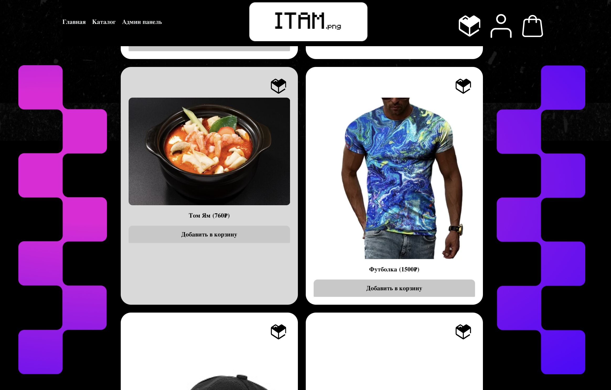
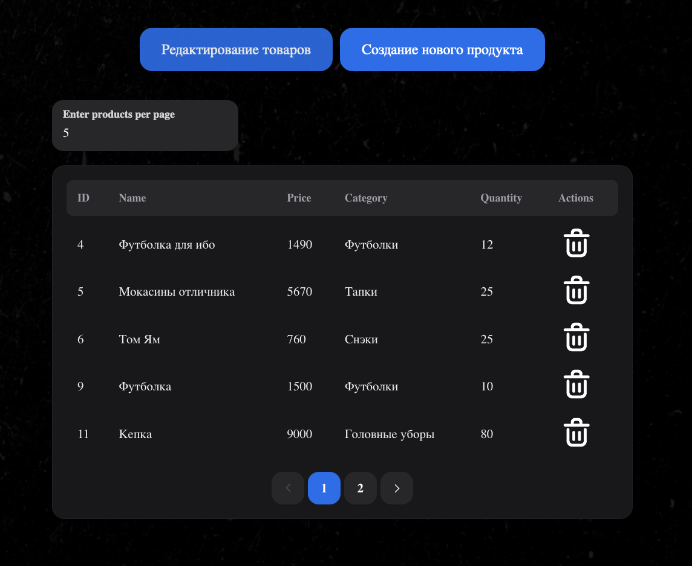
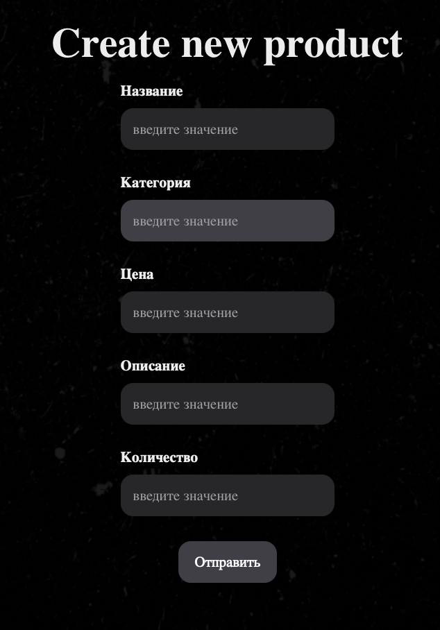

# ITAM shop

## Introduction
ITAM Shop is a powerful web application for managing your online store. It provides all the necessary tools for efficient management of products, orders, and customers.
<table>
  <tr>
    <td>
      
      <p align="center">Catalog functionality</p>
    </td>
    <td>
      
      <p align="center">Login page</p>
    </td>
  </tr>
  <tr>
    <td>
      
      <p align="center">Admin panel</p>
    </td>
    <td>
      
      <p align="center">Create new product</p>
    </td>
  </tr>
</table>

## Installation and running the application

To get started with ITAM Shop, follow these steps:

1. **Clone the repository**:
    ```bash
    git clone https://github.com/yourusername/ITAM_shop.git
    ```

2. **Navigate to the project directory**:
    ```bash
    cd ITAM_shop
    ```

3. **Install and start Docker**: <br>

    ```bash
    # Install Docker
    sudo apt-get update
    sudo apt-get install -y docker.io

    # Ensure Docker is installed correctly
    sudo systemctl start docker
    sudo systemctl enable docker
    docker --version

    # Install Docker Compose
    sudo curl -L "https://github.com/docker/compose/releases/download/1.29.2/docker-compose-$(uname -s)-$(uname -m)" -o /usr/local/bin/docker-compose
    sudo chmod +x /usr/local/bin/docker-compose

    # Ensure Docker Compose is installed correctly
    docker-compose --version
    ```

4. **Start the project**:
    ```bash
    docker-compose up
    ```

5. **Stop the application**:
    ```bash
    docker-compose down
    ```

## Usage

After starting the application, you can access it in your web browser at [http://localhost:5173](http://localhost:5173). From there, you can start adding and managing your IT assets.

## Features

- **Inventory management**: Manage inventory levels and receive notifications when stock is running low.
- **User management**: Control access to the application with user roles and permissions.

## Contributing

We welcome contributions! Please fork the repository and submit a pull request with your changes. Make sure to follow the project's coding standards and include tests for any new features or bug fixes.

## License

This project is licensed under the MIT License. See the [LICENSE](LICENSE) file for more details.