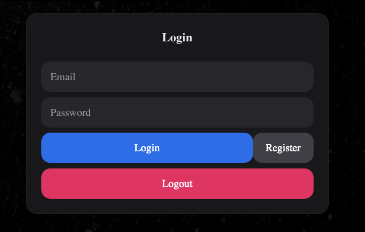

# ITAM shop

## Введение
ITAM Shop - это мощное веб-приложение для управления вашим интернет-магазином. Оно предоставляет все необходимые инструменты для эффективного управления товарами, заказами и клиентами.
<table>
  <tr>
    <td>
      
      <p align="center">Функционал каталога</p>
    </td>
    <td>
      
      <p align="center">Страница входа</p>
    </td>
  </tr>
  <tr>
    <td>
      
      <p align="center">Админ панель</p>
    </td>
    <td>
      
      <p align="center">Создание нового продукта</p>
    </td>
  </tr>
</table>

## Установка и запуск приложения

Чтобы начать работу с ITAM Shop, выполните следующие шаги:

1. **Клонируйте репозиторий**:
    ```bash
    git clone https://github.com/yourusername/ITAM_shop.git
    ```

2. **Перейдите в каталог проекта**:
    ```bash
    cd ITAM_shop
    ```


3. **Установите и запустите docker**: <br>

    ```bash
    # Установите Docker
    sudo apt-get update
    sudo apt-get install -y docker.io

    # Убедитесь, что Docker установлен правильно
    sudo systemctl start docker
    sudo systemctl enable docker
    docker --version

    # Установите Docker Compose
    sudo curl -L "https://github.com/docker/compose/releases/download/1.29.2/docker-compose-$(uname -s)-$(uname -m)" -o /usr/local/bin/docker-compose
    sudo chmod +x /usr/local/bin/docker-compose

    # Убедитесь, что Docker Compose установлен правильно
    docker-compose --version
    ```

4. **Запустите проект**:
    ```bash
    docker-compose up
    ```

5. **Отключите приложение**:
    ```bash
    docker-compose down
    ```

## Использование

После запуска приложения вы можете получить к нему доступ в вашем веб-браузере по адресу [http://localhost:5173](http://localhost:5173). Оттуда вы можете начать добавлять и управлять вашими ИТ-активами.


## Особенности

- **Управление инвентарем**: Управляйте уровнями запасов и получайте уведомления, когда запасы заканчиваются.
- **Управление пользователями**: Контролируйте доступ к приложению с помощью ролей и разрешений пользователей.
